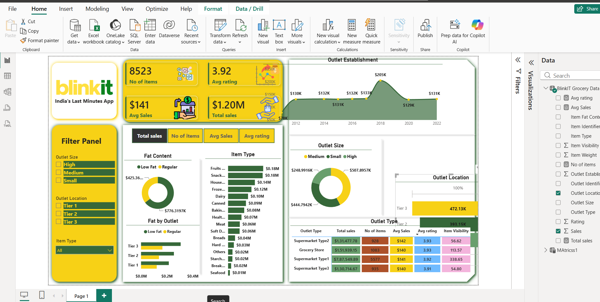

# 🛒 Blinkit Sales Analysis Dashboard | Power BI

## 📊 Project Overview

This project presents an interactive **Blinkit Sales Analysis Dashboard** built using **Microsoft Power BI**.

The objective of this project is to analyze Blinkit's sales performance, customer purchasing patterns, product categories, outlet performance, and other key business metrics to generate meaningful insights and support data-driven decision-making.

The original dataset was provided in **CSV format**. Data cleaning and transformation were performed using **Power Query within Power BI**, followed by data analysis, DAX calculations, and dashboard development.

---

## 🎯 Project Objectives

The main objectives of this project were:

* Analyze overall sales performance
* Understand sales distribution across product categories
* Identify high-performing product types
* Analyze outlet performance
* Compare sales across different outlet characteristics
* Understand customer purchasing patterns
* Identify important business KPIs
* Create an interactive dashboard for business analysis

---

## 🛠️ Tools & Technologies

| Tool            | Purpose                               |
| --------------- | ------------------------------------- |
| **Power BI**    | Dashboard development & visualization |
| **Power Query** | Data cleaning & transformation        |
| **DAX**         | Measures and calculations             |
| **CSV**         | Source dataset                        |

---

## 🧹 Data Cleaning & Transformation

The dataset was originally available in CSV format.

The following data preparation steps were performed using **Power Query in Power BI**:

* Removed unnecessary columns
* Checked and corrected data types
* Handled missing/null values
* Cleaned inconsistent values
* Renamed columns where required
* Standardized categorical data
* Performed transformations required for analysis
* Prepared the dataset for visualization

---

## 📌 Key KPIs

The dashboard focuses on important business metrics such as:

* 💰 **Total Sales : $1.20M**
* 🧾 **Number of Items Sold : 8,523**
* ⭐ **Average Sales : $141**
* 🏪 **Average Rating: 3.92**
* 📍 **Highest displayed outlet-establishment sales: ~$205K in 2018 **

---


## 📊 Dashboard Analysis

The dashboard provides insights into:

### 1. Sales Performance

Analyzes overall sales and identifies patterns in revenue generation.

### 2. Product Analysis

Provides insights into different product categories and identifies categories contributing significantly to sales.

### 3. Outlet Analysis

Compares sales performance across different outlet types and characteristics.

### 4. Customer & Product Insights

Helps understand purchasing patterns and product-level performance.

### 5. Interactive Filtering

The dashboard includes interactive filters/slicers that allow users to analyze the data dynamically.

---

## 📈 Dashboard

The final Power BI dashboard provides an interactive interface for exploring Blinkit's sales data.

**Dashboard Preview:**



---

## 💡 Key Insights

Some of the major insights obtained from the analysis include:

* Identified the overall sales performance of the business.
* Compared performance across different product categories.
* Analyzed outlet-level sales contribution.
* Identified high-performing product segments.
* Evaluated customer purchasing patterns.
* Used KPIs to monitor overall business performance.

> **Note:** Specific numerical insights can be added based on the final dashboard results.

---

## 📂 Project Files

```text
Blinkit-Sales-Analysis/
│
├── Blinkit_Sales_Dashboard.pbix
├── Blinkit_Sales_Data.csv
├── Blinkit_Dashboard.png
├── README.md
└── Documentation/
    └── Project_Summary.pdf
```

### 📊 Power BI File

`Blinkit_Sales_Dashboard.pbix`

Contains the complete Power BI dashboard, Power Query transformations, data model, and DAX calculations.

### 📄 Dataset

`Blinkit_Sales_Data.csv`

Original CSV dataset used for the project.

### 🖼️ Dashboard Preview

`Blinkit_Dashboard.png`

Screenshot of the final Power BI dashboard.

---

## 🚀 Project Workflow

```text
CSV Dataset
     ↓
Power Query
     ↓
Data Cleaning
     ↓
Data Transformation
     ↓
Data Modeling
     ↓
DAX Measures
     ↓
Data Visualization
     ↓
Interactive Power BI Dashboard
     ↓
Business Insights
```

---

## 🎓 Skills Demonstrated

This project demonstrates practical experience in:

* Data Cleaning
* Data Transformation
* Power Query
* DAX
* Data Modeling
* KPI Development
* Data Visualization
* Business Analysis
* Dashboard Design
* Interactive Reporting

---

## 📌 Conclusion

The Blinkit Sales Analysis project demonstrates how raw CSV data can be transformed into an interactive business intelligence dashboard using Power BI.

The project combines **data cleaning, transformation, analysis, DAX calculations, and visualization** to convert raw data into meaningful business insights.

---

## 👨‍💻 Project By

**Jassleen kaur**

**Data Analytics | Power BI | SQL | Python**

---

⭐ If you find this project useful, feel free to star the repository!
